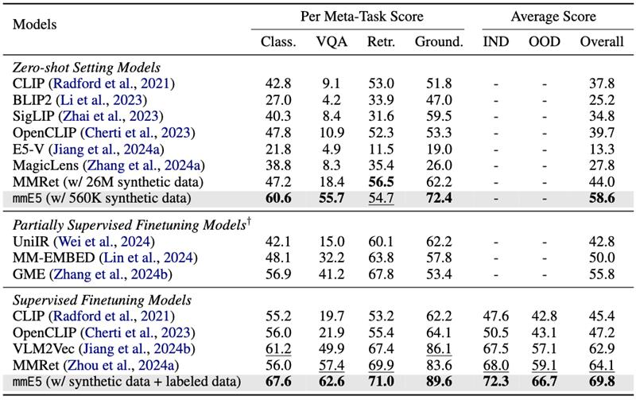

# [mmE5: Improving Multimodal Multilingual Embeddings via High-quality Synthetic Data](https://arxiv.org/abs/2502.08468)

This repository provides the source code, models, and datasets for our paper **mmE5: Improving Multimodal Multilingual Embeddings via High-quality Synthetic Data**. In our work, we explore integrating high-quality synthetic data to boost the performance of multimodal multilingual embeddings across diverse tasks.

[](https://arxiv.org/abs/2502.08468)
[](https://github.com/haon-chen/mmE5)
[](https://huggingface.co/datasets/intfloat/mmE5-synthetic)
[](https://huggingface.co/intfloat/mmE5-mllama-11b-instruct)
---

## Latest Updates
- **2025-02:** We release the paper, code, datasets and models of mmE5.

## Model Overview
Multimodal embedding models have gained significant attention for their ability to map data from different modalities, such as text and images, into a unified representation space. However, the limited labeled multimodal data often hinders embedding performance. Recent approaches have leveraged data synthesis to address this problem, yet the quality of synthetic data remains a critical bottleneck. In this work, we identify three criteria for high-quality synthetic multimodal data. First, broad scope ensures that the generated data covers diverse tasks and modalities, making it applicable to various downstream scenarios. Second, robust cross-modal alignment makes different modalities semantically consistent. Third, high fidelity ensures that the synthetic data maintains realistic details to enhance its reliability. Guided by these principles, we synthesize datasets that: (1) cover a wide range of tasks, modality combinations, and languages, (2) are generated via a deep thinking process within a single pass of a multimodal large language model, and (3) incorporate real-world images with accurate and relevant texts, ensuring fidelity through self-evaluation and refinement. Leveraging these high-quality synthetic and labeled datasets, we train a multimodal multilingual E5 model mmE5.  Extensive experiments demonstrate that mmE5 achieves state-of-the-art performance on the MMEB Benchmark and superior multilingual performance on the XTD benchmark.


## Datasets
Our experiments leverage a comprehensive dataset that combines real-world examples with synthetic data, covering a wide range of tasks and languages. We also provide the labeled training set of MMEB benchmark that includes mined hard negatives.
- [Synthetic Dataset](https://huggingface.co/datasets/intfloat/mmE5-synthetic)
- [MMEB with Hard Negative](https://huggingface.co/datasets/intfloat/mmE5-MMEB-hardneg)

## Experimental Results
mmE5 achieves SOTA performance on MMEB benchmark.



## Quick Start

```
pip install -r requirements.txt
```

- Preparation

```
bash scripts/prepare_images.sh
```

This script will download images from [Synthetic Dataset](https://huggingface.co/datasets/intfloat/mmE5-synthetic), [MMEB with Hard Negative](https://huggingface.co/datasets/intfloat/mmE5-MMEB-hardneg), [MMEB-eval](https://huggingface.co/datasets/TIGER-Lab/MMEB-eval), and [XTD](https://huggingface.co/datasets/Haon-Chen/XTD-10).

**Caution:** This could take a while as the images are large in size. Make sure you have enough disk space (at least 1T).

We have provided example scripts in the `scripts/` directory to help you get started with training and evaluation.
- Train
```
bash scripts/train/train.sh
```
- Test MMEB
```
bash scripts/eval/eval_full.sh
```
- Test XTD
```
bash scripts/eval/eval_full_multi.sh
```

You can also use `demo.py` to embed your own text and images.
```
python demo.py
```

## Acknowledgement
- We have adapted code from [VLM2Vec](https://github.com/TIGER-AI-Lab/VLM2Vec), a comprehensive implementation of transforming MLLMs to embedding models.


## Citation
```
@article{chen2025mmE5,
  title={mmE5: Improving Multimodal Multilingual Embeddings via High-quality Synthetic Data},
  author={Chen, Haonan and Wang, Liang and Yang, Nan and Zhu, Yutao and Zhao, Ziliang and Wei, Furu and Dou, Zhicheng},
  journal={arXiv preprint arXiv:2502.08468},
  year={2025}
}
```
